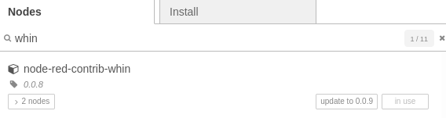

# node-red-contrib-whin
Node-red nodes that allow users to send Whatsapp text to one's mobile.

## Set-up and Usage:
Before using this node, we strongly recommend you read this FAQ:
https://github.com/inUtil-info/node-red-contrib-whin/wiki/FAQ

This package contains a configuration node, and a sender node which acts as a WhatsApp endpoint. 
The only thing required is a token, that can be retrieved by setting up Whin. To do so, just send a
text Whatsapp with your mobile to +34 613 164 997 including the word signup, and you will get your token in a response text.

Open the configuration node and fill in the fields *Phone* and *Token*, and you'll be all set.

- *Phone* field has the following format: countrycode and number, without spaces; example for Spain: 346XXYYYZZZ
- *Token* field has the following format: hex string, with 40 characters, no spaces; example: 21f5da020bad5919d1fba72e74c15da5881efb4a

Note that the Phone and Token values are linked, this means that the node wont work if the phone
number used to get the token is not matching the one you used to get the token. This is done to prevent spam.

Your token is valid for 30 days. We set the Time-To-Live of 30 days everytime you send a whatsapp
message using the node. Keep using the service from time to time, and it won't expire.
If you, for whatever reason, do not use the service for 30 days, you can get a new token repeating 
the process described above.

### Set-up and usage flow:

## Terms of use:
The service is free, you do not need to register, and we do not gather any Personal Info. 
We understand that the user sending the sign-up message wishes to use the service. The service is just 
sending whatsapp messages to the number that orginated the request. We do not share the numbers using the
service with anyone. We do not send messages to our users.

There is an hourly rate limit set to 100 messages per user. This is done to prevent errors of users testing the system.
The limit can and will be raised in the future.

If you wish to stop using the service, you just want to stop using the node and your token will be
deleted after 30 days.

## Types of messages:
At the moment, the only type of messages we route are text messages. 

## Error handling:
There are two types of errors that you can get when using the node:
  1. Token - Number pair invalid. This means, very likely, that you did a mistake on your number / token values on the config node
  2. Token do not exist: You either did not complete the sign-up step, or your token has expired (due to 30 days of inactivity)

## Configuration Node:
These are the fields that you need to complete to set up the whin config node:

## Sender Node:
These are no fields that you have to edit to send a whatsapp message. If you completed the config fields before, you are all set.

## Sample Flow:

Before inporting this flow, make sure you added the node-red-contrib-whin node on your palette:

You can inport this simple flow and just edit the config fields; add your phone/token pair, and you will get a whatsapp message when you click on the inject node. 

[{"id":"efd5d46d4d8baab4","type":"whin","z":"cb358f93.bea12","name":"","auth":"f160031f44835f95","x":350,"y":650,"wires":[["4703f7051e36f3da"]]},{"id":"8c62536e8bf67956","type":"inject","z":"cb358f93.bea12","name":"","props":[{"p":"payload"}],"repeat":"","crontab":"","once":false,"onceDelay":0.1,"topic":"","payload":"hello from node-red-contrib-whin","payloadType":"str","x":175,"y":650,"wires":[["efd5d46d4d8baab4"]]},{"id":"4703f7051e36f3da","type":"debug","z":"cb358f93.bea12","name":"","active":true,"tosidebar":true,"console":false,"tostatus":false,"complete":"false","statusVal":"","statusType":"auto","x":520,"y":725,"wires":[]},{"id":"f160031f44835f95","type":"whin-config","name":"whin","phone":"your_phone_goes_here","token":"your_token_goes_here"}]

