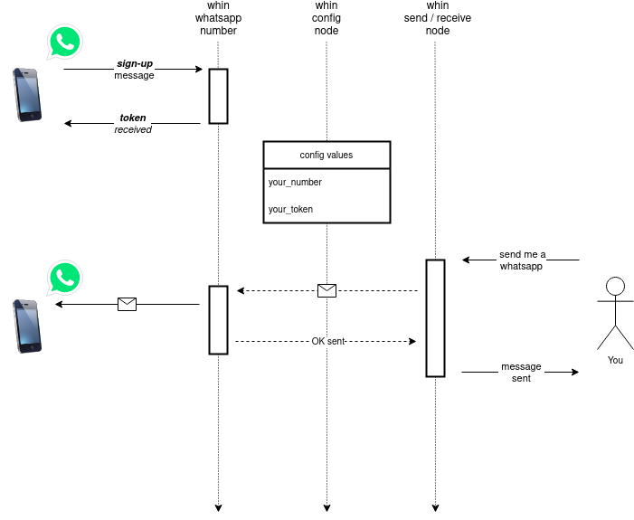

# Summary
Node-red nodes that allow users to keep a 2-way Whatsapp communication with one's mobile.
The package includes three nodes:
- whin-send, to send out whatsapp texts from your NR flows to your whatsapp number.
- whin-receive, to inject whatsapp texts from within whatsapp into node-red flows.
- whin-confirm, think of it as a confirmation gate; when used in the middle of a flow, you can request permission to proceed the execution of the flow.

## Install:

Your first choice should be using the Palette in node-red Editor.

If you are more confortable using the terminal, cd to the user directory and run this command:

    npm install node-red-contrib-whin

## Set-up and Usage:
Before using this node, we strongly recommend you read the FAQ first:
https://github.com/inUtil-info/node-red-contrib-whin/wiki/FAQ

The three nodes described above share a configuration node that stores your phone and private token.
To get your token, just send a text Whatsapp with your mobile to +34 613 164 997 including the word *signup*, and you will get your token in a response text.

If you click on this link: https://wa.me/34613164997?text=signup all you need is click send from within whatsapp and you'll get your token.

To set up whin: open the configuration node and fill in the fields *Phone* and *Token*, and you'll be all set.

- *Phone* field has the following format: countrycode and number, without spaces; example for Spain: 346XXYYYZZZ
- *Token* field has the following format: hex string, with 40 characters, no spaces; example: 21f5da020bad5919d1fba72e74c15da5881efb4a

Note that the Phone and Token values are linked, this means that the node wont work if the phone
number used to get the token is not matching the one you used to get the token. This is to prevent spam.

The token is valid for 30 days. Everytime you send a whatsapp message using whin-send node, Time-To-Live is reset to 30 days. Keep using the service from time to time, and it won't expire.
If for whatever reason you do not use the service for 30 days, your token will be removed from the cache. 
Dont panic, you can get a new token repeating the signup process.

### Set-up and usage flow:

## Types of messages:
At the moment, the only type of messages we route are text messages (UTF8 strings). This is not preventing you from sending json data, or any other data format you stringify first.

## Whin Nodes:
When you install node-red-contrib-whin package, you will get the following Nodes available on node-red Palette under the Network category: whin-receive, whin-send and whin-confirm. These Nodes rely on a configuration Node called whin-config (not visible on the editor Palette).

### Configuration Node:
This node will be used to enter your credentials as shown below; each credentials pair (phone and token) will be available and shared among all whin nodes.
These are the fields that you need to complete to set up the whin-config node:

Bear in mind: 
- Do NOT include '+' before your countrycode,
- Do NOT include a '-', or any other character or space (anything which is not a number) as part of your phone number.
- If you do not know, or are not sure of, which is your country code check this: https://countrycode.org/
- Make sure the token has no spaces before or after:

### Sender Node (whin-send):
This is the node we recomend you start using. If you completed and saved the config, you are all set.  Just select the configuration (next to Auth on the pic):

Wire an inject node to whin-send, press inject, and you should receive a whatsapp including the text. Anything that comes in whin-send as data payload will be sent.

### Receiver Node (whin-receive):
Whin-receive node will allow you sending whatsapps to your node-red environment, any text message you send to the whin number used to sign-up and get the token, will be received and treated as message payload by whin-receive.
You might create your own syntax to trigger stuff in your NR. Switching on lights or music, disconnect the alarm or run a sales report. Sky is the limit.

### Confirmation Node (whin-confirm):
This node sends a request to get an active user confirmation; when answered, you will get the response as an output of the node. 
There's a max time to answer on whatsapp, if you reach the time without answering, the output payload will contain a time-out msg.

whin-confirm node will take two inputs: a question and a time period. The question goes on the msg.payload property and a time-to-live (ttl) in the msg.ttl property (this integer number is treated as time, expressed in miliseconds). These are the two inputs expected.

When the node is triggered, it will send you a whatsapp with the question you entered on the payload, and you will have a time to answer it (yes/no). 
If you click "Yes" on whatsapp, you will get a "YES" as output of the node.
If you click "No", you will get a "NO" on node-red output.
If you reach the ttl and provide no answer, the node will default to a "Time-out" message.

Each transaction is unique, meaning that you can only get one output after each trigger: YES, NO or Time-out

We like to think of it as the SMS / push-notifications you get from your bank these days, but answered with a simple button. The main use-case here is allowing you to "authorize" the execution of a flow branch that you don't want to run without manual intervention on node-red.

Be mindful that if there is a whin-receive node running in parallel, the response will flow through both listeners. In that case, you might notice a difference.
whin-confirm will output Yes, No, or TimeOut while your whin-receive node will receive whatever the answer is together with a 'unique request identifier'. That's the raw response.

There's plenty of use-cases where one wants to grant permission to a flow, like: door opening, a server restart based on some alert / timing. In plain english: You get the request, you authorise, decline or ignore it.

The backend controls the message expirity as well and, should you exahust the ttl, will respond directly in your phone and won't send the response back to node-red.

## Sample Flows:

We are including a very simple flow that will send a whatsapp, you can use it to bootstrap your own use cases. 

Before inporting this flow, make sure you added the node-red-contrib-whin node on your palette:

You can inport this simple flow, just edit the config fields; add your phone/token pair, and you will get a whatsapp message when you click on the inject node.

    [{"id":"efd5d46d4d8baab4","type":"whin","z":"cb358f93.bea12","name":"","auth":"f160031f44835f95","x":350,"y":650,"wires":[["4703f7051e36f3da"]]},{"id":"8c62536e8bf67956","type":"inject","z":"cb358f93.bea12","name":"","props":[{"p":"payload"}],"repeat":"","crontab":"","once":false,"onceDelay":0.1,"topic":"","payload":"hello from node-red-contrib-whin","payloadType":"str","x":175,"y":650,"wires":[["efd5d46d4d8baab4"]]},{"id":"4703f7051e36f3da","type":"debug","z":"cb358f93.bea12","name":"","active":true,"tosidebar":true,"console":false,"tostatus":false,"complete":"false","statusVal":"","statusType":"auto","x":520,"y":725,"wires":[]},{"id":"f160031f44835f95","type":"whin-config","name":"whin","phone":"your_phone_goes_here","token":"your_token_goes_here"}]

## Demo videos:

Do you want more videos? check this playlist: 
https://www.youtube.com/playlist?list=PLY4sFY6dmLqxpt3SM5IagyMSdCAc6WNMP

## Error handling:
There are two types of errors that you can get when using the nodes:
  1. Token - Number pair invalid. This means, very likely, that you did a mistake on your number / token values on the config node
  2. Token do not exist: You either did not complete the sign-up step, or your token has expired (due to 30 days of inactivity)

## Known bugs on previous releases. Please update to latest release if you notice these:
Occasionally, whin-receive and whin-confirm do not start capturing messages unless a 'deploy' is executed even if there are no changes.
whin-receive may show the listening status and yet messages may not arrive until a flow redeploy is executed.
whin-confirm times out and does not show the confirmation.

## Security:
While we have not implemented military-class security, we have done our best to secure data in transit and at rest.
However, it's our recommendantion to read carefully the Security questions and answers on our FAQ first:
https://github.com/inUtil-info/node-red-contrib-whin/wiki/FAQ

## Terms of use:
The service is free, you do not need to register, and we do not gather any Personal Info. 
We understand that the user sending the sign-up message wishes to use the service. The service is just 
sending whatsapp messages to the number that orginated the request. We do not share the numbers using the
service with anyone, nor we send messages to our users.
For now there is an hourly rate limit set to 10 messages per user. When you reach 10 msg in one hour your msgs will not be
delivered till the 1 hour timer is reset. Whin will send you a reminder of the limit. If you don't adjust how your runtime 
works and get to 50 msgs in 1 hr, your IP will be blocked. This is something we implemented as a consequence of the abuse usage of the service.
If you wish to stop using the service, you just want to stop using the node and your token will be deleted after 30 days.
